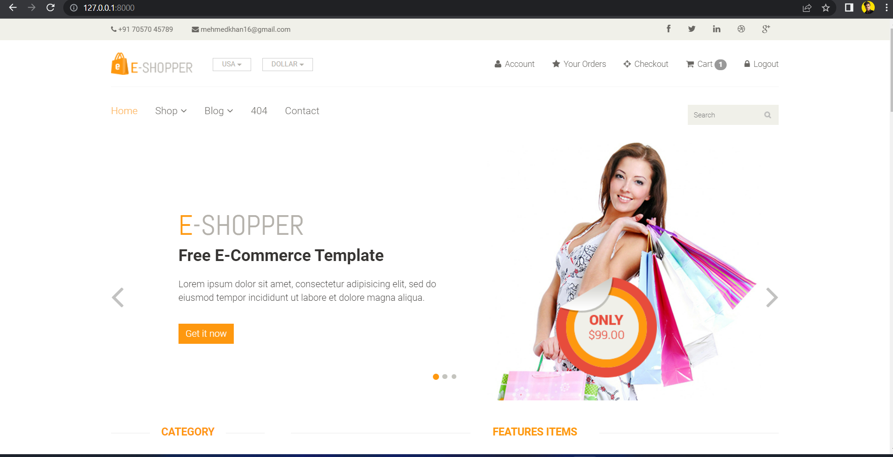
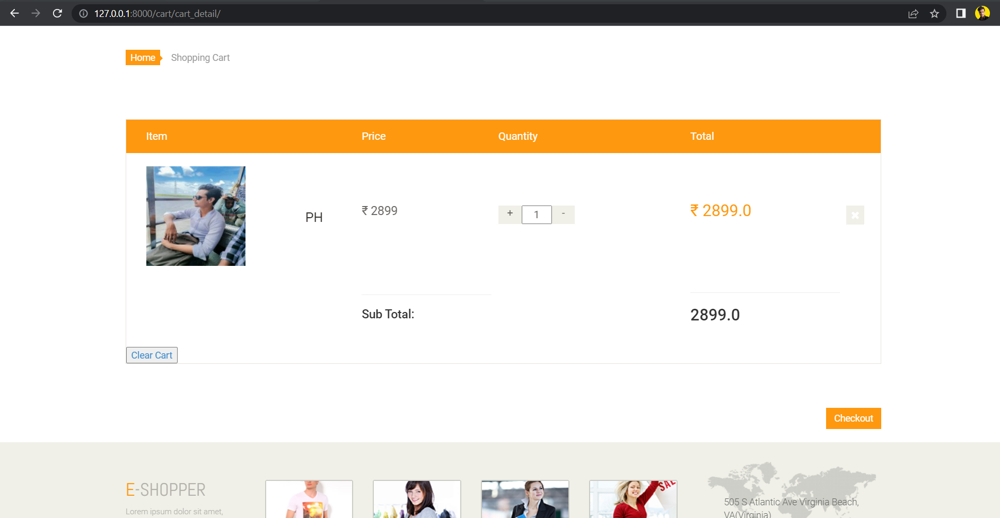
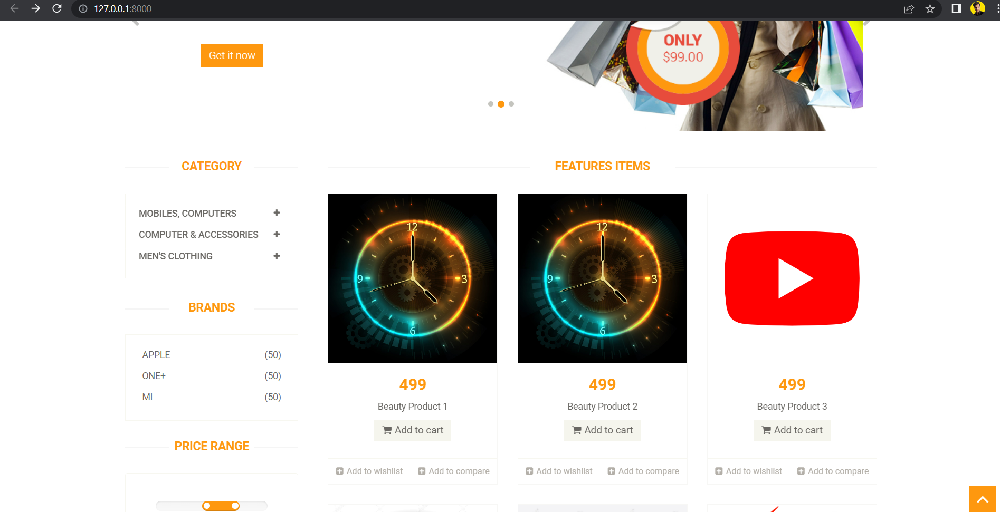

# E-shop
"Django-powered e-commerce platform with customizable user interface, robust security, seamless payment options, and intuitive backend management. Ideal for small businesses to large enterprises."
# Django E-Commerce Platform

A powerful e-commerce platform built using the Django framework. 

## Features

- User-friendly interface
- Highly customizable
- Robust security features
- Seamless payment integrations
- Intuitive backend management system

## Getting Started

These instructions will get you a copy of the project up and running on your local machine for development and testing purposes.

### Prerequisites

You will need to have the following software installed on your system:

- Python 3.x
- Django 3.x
- A database system (e.g. PostgreSQL, MySQL)

### Installation

1. Clone this repository to your local machine

2. Navigate to the project directory

3. Install the required packages

4. Run migrations to create the necessary database tables

5. Start the development server

6. Open your browser and navigate to `http://127.0.0.1:8000/` to view the platform

## Contributing

We welcome contributions to this project. If you have any ideas or suggestions, please feel free to open an issue or make a pull request.

## License

This project is licensed under the MIT License. See the [LICENSE](LICENSE) file for details.

